# GESTURE_CONTROL

# 🖐️ HandGesture-Controlled Computer Interaction 🖥️

👋 Welcome 🎉 to HandGesture-Controlled-Computer! 🖐️ This 🚀 project revolutionizes 🌟 your computer interaction experience, empowering you 🌈 to control 🎮 your device using intuitive 👌 hand gestures. From adjusting volume 🔊 to switching workspaces 🌌, this project 🛠️ unlocks a new realm 🌠 of possibilities! 💫 Let's dive 🏊 into the future! 🚀

Absolutely, let's make it more fun and engaging with lots of emojis:

### How would you like to revolutionize your computer interaction experience? 🌟💻🎉

- Imagine effortlessly adjusting the volume 🎚️ with a wave of your hand. Is that something you'd love to do? 🌊🖐️🔊

- What about seamlessly switching between workspaces 🌌 with a simple gesture? Would that enhance your productivity? 🔄🌟💼

- Have you ever wished you could control your mouse cursor 🖱️ without even touching the mouse? How convenient would that be? 🙌✨🖱️

- Picture this: capturing screenshots 📸 with just a flick of your hand. Would that make your life easier? 📸✨🖐️

Let's make exploring HandGesture-Controlled-Computer a fun and exciting journey! 🚀🖐️💻

## 🚀 Features 

- 🎚️ **Volume Control**: Adjust volume 🔊 by raising or lowering your hand. 🖐️💬🔊
  
- 💡 **Brightness Control**: Dim or brighten your screen with a simple gesture. 💡🌟🌗

- 🌌 **Workspace Switch**: Navigate between workspaces 🖥️ effortlessly for enhanced productivity. 🚀🔄🌌

- 🖱️ **Mouse Control**: Control the mouse cursor 🖱️ with intuitive hand movements. 🖱️👆🖼️

- ⏰ **Clock Display**: Display the current time on-screen with a gesture. ⏰👀🖥️

- 🖱️✨ **Left Click & Drag**: Perform left-click actions and drag items with ease. 🖱️✨👆📂

- ⚡ **Super Key Control**: Activate shortcuts with a simple gesture for quick access to commands. ⚡👆⌨️

- 🚫 **Shutdown**: Power off your computer gracefully with a gesture. 🚫🖐️💻

- 📸 **Screenshot**: Capture screenshots effortlessly by gesturing. 📸✨📷

- 🎵 **Media Control**: Play, pause, and control media playback with intuitive hand movements. 🎵⏯️🖐️

- 🔄 **Processing Control**: Start and stop processing tasks with ease using gestures. 🔄🚦🖐️

## Usage 🖐️
Once the application is running, perform the respective hand gestures for the actions you want to execute. Refer to the documentation for a list of supported gestures and corresponding commands.

## Contributing 🤝
Contributions are welcome! If you have ideas for new features, improvements, or bug fixes, feel free to open an issue or submit a pull request.

## Support 🚀
For any questions, feedback, or assistance, please reach out to us via the issue section of this repository. Our team is here to help you make the most out of HandGesture-Controlled-Computer!

## COMPATIBILITY
* Tested on `ubuntu 22` and `bash`

* Open to resolve issues and contribute

## INSTALLATION
* `cd GESTURE_CONTROL`

* `chmod +x install.sh`

* `./install.sh`

## EXECUTION
* `python3 test.py`

## SUPPORTED GESTURES
### SHUT DOWN
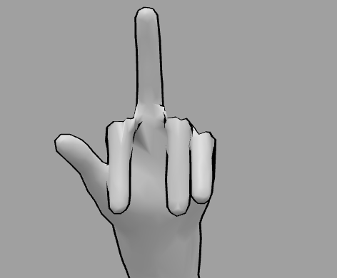

### MOUSE POINTER
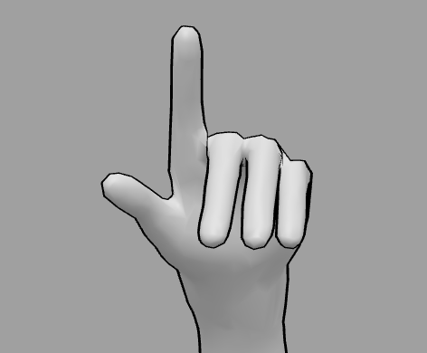

### LEFT CLICK
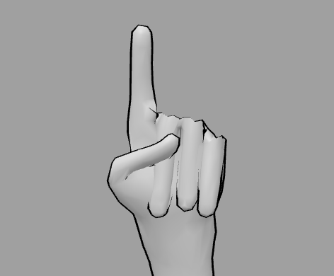

### RIGHT CLICK
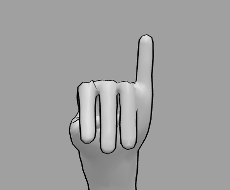

### DRAG
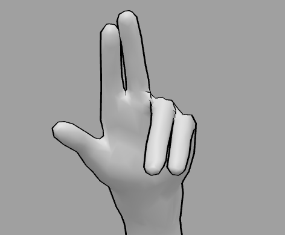

### SCREENSHOT

### VOLUME
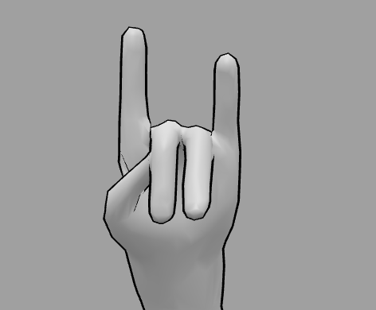

### BRIGHTNESS
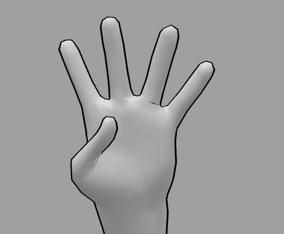

### WORKSPACE
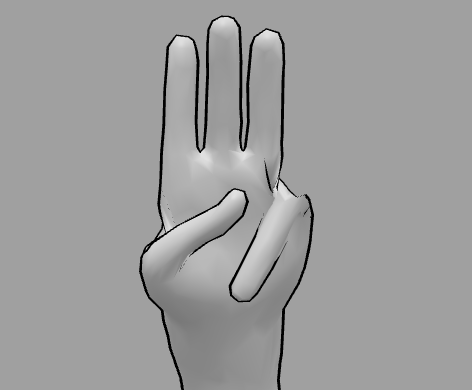

### SPACE BAR
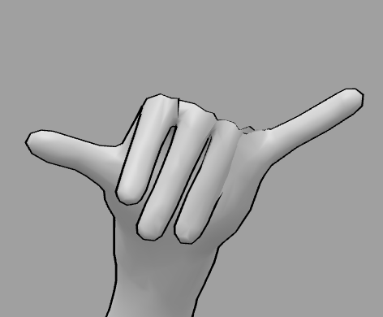

### SUPER KEY
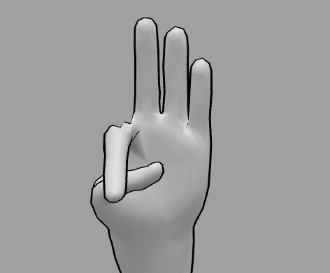

### START PROCESSING
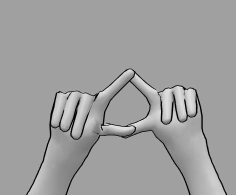

### STOP PROCESSING
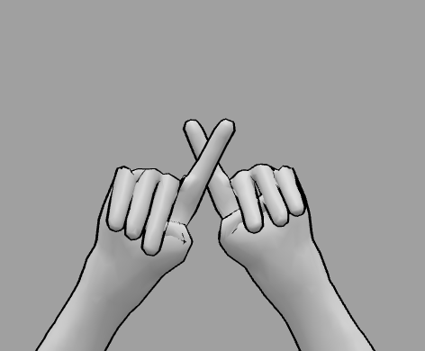

## License 📄
This project is licensed under the MIT License - see the LICENSE file for details.
