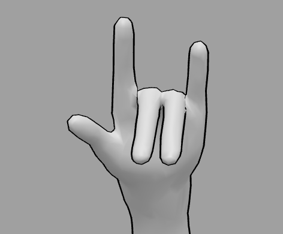

# GESTURE_CONTROL

* Want to have some fun ?

* Want to control your computer using hand gestures ?

* We got you !

## COMPATIBILITY
* Tested on `ubuntu 22` and `bash`

* Open to resolve issues and contribute

## INSTALLATION
* `cd GESTURE_CONTROL`

* `chmod +x install.sh`

* `./install.sh`

## USAGE
* `python3 test.py`

## SUPPORTED GESTURES
### SHUT DOWN
* Show two fuck you simultaneously to shutdown

### MOUSE POINTER
* You can move mouse

### LEFT CLICK
* Click any object

### RIGHT CLICK
* Get optoins for any object

### DRAG
* Drag an object

### SCREENSHOT
* Take screenshot

### VOLUME
* Hold the gesture and move it up and down

### BRIGHTNESS
* Hold the gesture and move it up and down

### WORKSPACE
* Hold the gestue and take it to left or right edge

### SPACE BAR
* Play/pause a video or audio

### SUPER KEY
* Open the main menu of OS

### START PROCESSING
* Start processing if you have stopped it

### STOP PROCESSING
* Stop the processing manually

